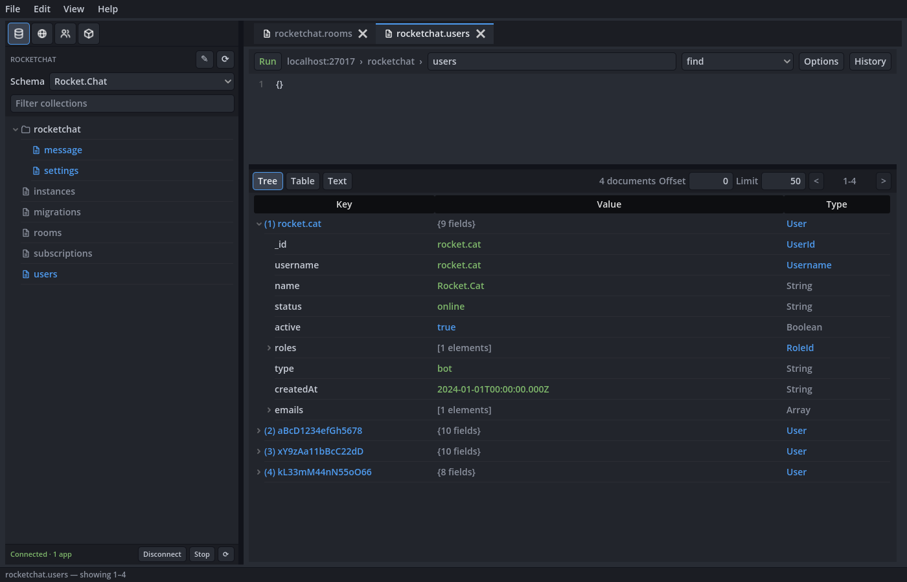
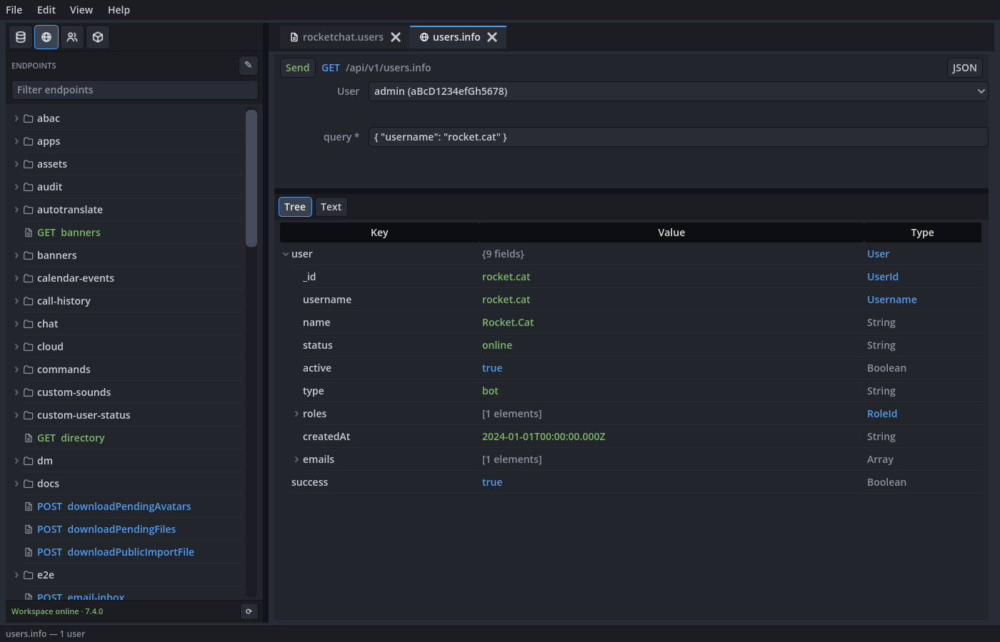
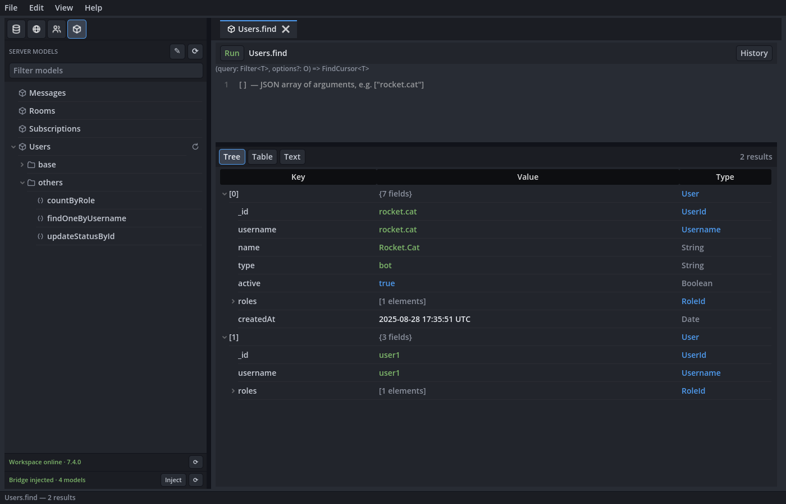

# Debris

A desktop client for exploring **MongoDB** databases, **Rocket.Chat** REST APIs,
and a local Rocket.Chat server's **models** side by side, modeled on the workflow
of the old [Robo3T](https://github.com/Studio3T/robomongo) Mongo client. It pairs
a connection/endpoint sidebar with a tabbed workspace: a code editor on top,
results below, toggleable between **Tree**, **Table**, and **Text (JSON)** views.

The app is built with [Godot 4.7](https://godotengine.org/) (GL Compatibility
renderer) and talks to MongoDB through a small bundled [Fastify](https://fastify.dev/)
proxy server it launches for you.

## Screenshots

**Browsing a MongoDB collection** — the collection sidebar (grouped by name
prefix, filterable) on the left over the bundled server's panel, and a query tab
with a JSON filter editor above a results tree on the right.



**Browsing a Rocket.Chat REST API** — the endpoint sidebar (grouped by resource,
driven by the server's OpenAPI spec), a per-endpoint request form with a user
selector, and the response, in a tab next to a query on the project's database.
The line under the sidebar reports whether the workspace is answering.



**Calling a server model** — the models the Server Models bridge found in the
running Rocket.Chat, each model's functions grouped under it, and a function tab
whose results are typed against the collection the model reads. The two footer
lines separate the workspace from the bridge injected into it.



The screenshots are captured from the real UI against the fixture data, by
[`client/dev/shots.sh`](client/dev/shots.sh).

## What it's good for

Debris grew out of everyday debugging — the kind where you bounce between a
database and an API and back, repeating the same fiddly steps. A few workflows it
is built to make painless:

- **Following an ID across collections.** Debugging often means pulling an
  identifier out of one document and looking it up in another, over and over.
  Right-click a record and jump straight to the linked records in other
  collections, instead of copying IDs by hand each time.
- **A database and an API, side by side.** Grab a value from a live document and
  fire an API call with it without juggling windows. This matters most when
  timing does — e.g. prepare a request in advance, read an ID off a record the
  moment it appears (while a call is still ringing), and send, all in one place,
  rather than shuttling between a Mongo client and a separate API tool.
- **Testing an API as different users.** Rather than pasting a permanent auth
  token into Swagger, Debris retrieves the token for you from a saved password.
  Calling the same endpoint as several users — or as no user at all, to confirm
  auth is actually being enforced — is a quick switch, so comparing responses is
  trivial.
- **Calling the server's own model methods.** For a Rocket.Chat checkout you are
  working on, Debris can call `@rocket.chat/models` methods (`Users.findOneById`,
  `Subscriptions.findByRoomId`, …) directly on your running dev server — the
  query the server would run, not your reconstruction of it in raw Mongo.

## Concepts

Debris is a **document-based** app. You work in **projects** — a project is a
file (`.debris-project`) that optionally binds:

- **≤ 1 MongoDB database**, and
- **≤ 1 Rocket.Chat workspace** (its REST API, its users, and optionally a local
  Rocket.Chat repository path for the model bridge).

Both are optional; a project can have either, both, or neither. Keeping a database
and a workspace in the same project is what links them: a value in an API response
can open a matching MongoDB query in a sibling tab, with no cross-project plumbing.

A left-hand **activity bar** switches the sidebar between the project's views:
**Collections** (when a DB is attached), and **Endpoints**, **Users** and
**Server Models** (when a workspace is attached). All open tabs — queries,
endpoint requests, model calls, JSON scratchpads — share one tab strip. Each
sidebar has a filter box in its header that narrows the list as you type.

Projects can be saved anywhere or kept memory-only as *Untitled*. Alongside a
saved project, Debris writes a per-user `.debris-workspace` sidecar (git-ignored)
holding your open tabs and an offline cache of the API's endpoint list, so
reopening the project restores your workspace. Queries you run are remembered
per collection: **recents** live in the sidecar (capped, they turn over), while
queries you **favorite** are stored in the project file and travel with it.

## Repository layout

```
client/      Godot 4.7 project — the desktop app (GDScript, source/ui + source/data)
  server/    the bundled server, embedded into the app (produced by `yarn bundle`)
  dev/       headless validation kit (compile checks, mocked harness, fixtures,
             and the screenshot capture)
  test/      logic-layer unit tests (addon-free runner)
server/      Node/TypeScript source for the bundled server
deploy.sh    build the Linux + macOS release artifacts
docs/        screenshots and other documentation assets
```

The **server** is a stateless proxy: every request carries its own MongoDB
connection details (or Rocket.Chat target), it runs the operation, and returns the
result — nothing is stored server-side. It exposes:

- `GET /health`, plus `POST /clients/heartbeat` and `/clients/disconnect` (how
  connected apps announce themselves);
- `POST /api/*` MongoDB operations — `ping`, `databases`, `collections`, `find`,
  `findOne`, `count`, `explain`, `listIndexes`, `aggregate`, `insert`, `update`,
  `delete`, `command`;
- `POST /api/rocketchat/*` model-bridge operations — `install`, `status`,
  `model-methods`, `call`.

The client never speaks the MongoDB wire protocol itself. Rocket.Chat's REST API,
by contrast, is called directly by the client.

## Getting started

### Prerequisites

- **[Godot 4.7](https://godotengine.org/download)** (standard, non-.NET build) —
  to run or edit the client from source.
- **[Node.js](https://nodejs.org/) 20+** — required at runtime: the app launches
  the bundled server with `node`. If Node isn't found the app still runs, but
  MongoDB features stay offline until you start a server yourself.
- **[Yarn](https://yarnpkg.com/) 4** — only needed to build the server bundle
  from source.
- **A Rocket.Chat checkout and `meteor`** — only for the Server Models view; the
  bridge is installed into your running dev server through `meteor shell`. The
  server looks for `meteor` on `PATH` and then in the usual install locations
  (`/usr/local/bin`, `~/.meteor`, Homebrew), which matters because an app opened
  from a desktop inherits a minimal `PATH`. Set `DEBRIS_RC_METEOR_BIN` if yours
  lives somewhere else.

### 1. Build the server bundle

The client runs a single-file server bundle it carries at
`client/server/debris-server.cjs`. Rebuild it from the TypeScript source with:

```bash
cd server
yarn install
yarn bundle
```

`yarn bundle` writes the bundled server into the client project so it can be
embedded in the app. (For working on the server on its own, `yarn dev` runs it in
watch mode and `yarn build` compiles to `dist/`.)

### 2. Run the client

Open the `client/` folder in the Godot editor and press **Play**, or run it
from the command line:

```bash
godot --path client
```

On launch the app checks whether a server is already answering at
`http://127.0.0.1:4020` and attaches to it if one is — but launching the app
never starts one on its own. A server is started when you actually need it:
opening a project that has a database, configuring a database connection, or
pressing **Connect** in the Collections footer (below). Starting one locates
`node`, extracts the bundled server, and runs it as a **quiet background
process** (no console window). While attached, the app heartbeats the server
every 30s and sends a disconnect on close, so the server knows who is connected.
A server the app launched stops itself once the last connected app goes away (so
runs never leave an orphaned server behind); a server you started by hand keeps
running and is simply reused.

The footer of the **Collections** view puts that server in reach: one line
reporting whether it's running and whether this app is attached to it, with
buttons to **Connect** (starting a server if none is answering), **Disconnect**,
**Stop**, and re-read the state. Reading the state registers nothing, so the
panel can report on a server the app is deliberately detached from. Disconnecting
sends the same signal closing the app does, so a server the app launched stops
itself once nothing is connected; **Stop** is how you end one you started by
hand.

The **Endpoints**, **Users** and **Server Models** views carry the matching line
for the project's Rocket.Chat workspace — whether it's answering, and which
version — but read-only: a workspace runs wherever it runs, so there's only a
refresh to re-check it. All three act on that one server, so all three report on
it. The endpoint catalog still loads by itself when a project opens; if the
workspace is down that goes to the activity log without a popup, and the list
falls back to the cached or built-in catalog.

**Server Models** carries a second line below that one for the injected bridge:
whether the models endpoint is answering and how many models it reports, with
**Inject** to run it into the running server. The two are separate facts — the
workspace can be up with nothing injected — and the bridge is asked about live,
since Rocket.Chat drops the handler when it restarts. The header's ⟳ only
re-reads the model list from the endpoint that's already there; injecting runs
`meteor shell` and is its own button. Opening a project still tries the
injection, but quietly: nothing is running yet is the ordinary state of a project
you just opened, so it goes to the activity log and the panel rather than a
dialog.

Useful environment overrides:

| Variable                | Purpose                                              |
| ----------------------- | ---------------------------------------------------- |
| `DEBRIS_NODE`           | Path to a specific `node` binary.                    |
| `DEBRIS_SERVER_URL`     | Point the client at an already-running server.       |
| `PORT` / `HOST`         | Where the server listens (default `4020` / `127.0.0.1`). |
| `DEBRIS_RC_METEOR_BIN`  | The `meteor` executable used to install the model bridge. Only needed when it isn't on `PATH` or in the usual install locations. |

## Using the app

1. **Create a project** — *New Project* on the start screen (or `File ▸ New
   Project`). Past projects are one click away under `File ▸ Open Recent`.
2. **Attach a source** — use the activity-bar icons or `File ▸ Attach Database…`
   / `Attach Workspace…`.
   - *Database*: enter the MongoDB `host:port` (and optional auth), then pick a
     database.
   - *Workspace*: enter the Rocket.Chat server URL, and — if you want the Server
     Models view — the path to your local Rocket.Chat repository. Add login users
     in the **Users** view.
3. **Query MongoDB** — click a collection to open a query tab, edit the JSON
   filter, choose an operation (`find`, `countDocuments`, `explain`,
   `listIndexes`, `findOne`), and press **Run**. Results paginate server-side.
   Right-click a document for View / Edit / Insert / Delete, copy actions,
   *Sort by this field*, *View JSON in New Tab*, and the schema's typed actions —
   the cross-collection jumps that follow an ID to the records that reference it.
   The history button browses the collection's recent and favorited queries.
4. **Call the API** — click an endpoint to open a request tab (several tabs can
   target the same endpoint), pick the user to authenticate as, fill the
   parameter form (or switch to the raw-JSON editor), and press **Send**.
   Responses are typed the same way documents are, so a value in a response can
   open a query on the database.
5. **Call server models** — in **Server Models**, refresh to inject the bridge
   into your running Rocket.Chat dev server, then browse each model's functions
   (its own methods grouped by name, everything inherited from `IBaseModel` under
   *base*). Double-click a function to open a tab: it shows the method's
   signature, takes a JSON array of arguments, and renders the result — cursors
   materialized — typed against the model's collection.
6. **Scratch JSON** — `File ▸ New JSON` / `Open JSON…` opens a JSON tab: paste
   any JSON, press **Show**, and read it in the same Tree/Text views (no backend
   involved). `File ▸ Save JSON…` writes it back out.
7. **Review what ran** — `File ▸ Activity Log` opens a live log of every MongoDB
   operation, REST call, and server lifecycle event, with inputs, outcome, and
   duration.
8. **Save** — `File ▸ Save Project` writes a `.debris-project` file; your open
   tabs are remembered next to it.

### Keyboard shortcuts

| Action                          | Shortcut                          |
| ------------------------------- | --------------------------------- |
| New / Open / Save / Save As     | `Ctrl/Cmd` + `N` / `O` / `S` / `Shift+S` |
| Run the active tab              | `F5` or `Ctrl/Cmd` + `Enter`      |
| Switch to sidebar view 1–3 (Collections / Endpoints / Users) | `Alt` + `1` / `2` / `3` |
| Jump to inner tab _n_ (`9` = last) | `Ctrl/Cmd` + `1`…`9`           |
| Cycle inner tabs                | `Ctrl` + `Tab` / `PageUp` / `PageDown` |
| Close the active tab            | `Ctrl/Cmd` + `W`                  |
| Quit                            | `Ctrl/Cmd` + `Q`                  |

`View ▸ UI Scale` adjusts the interface size, and the choice is remembered.

## Releases and updates

Exported builds are published to [GitHub Releases](https://github.com/pierre-lehnen-rc/debris/releases)
as `debris-linux.x86_64` and `debris-mac.app.zip`. The app runs a quiet check for a newer
release shortly after launch — and on demand via `Help ▸ Check for Updates…` —
and can download and install it in place, then relaunch. Running from source or on another platform,
it falls back to opening the release page.

To build the artifacts yourself — bump `config/version` in `client/project.godot`
first, then:

```bash
./deploy.sh
```

It refreshes the server bundle and exports both platforms into
`client/export/release/`, ready to attach to the release. It does not tag or
publish anything.

## Development

The client ships with a headless validation kit (see
[`client/dev/README.md`](client/dev/README.md)) that runs without the editor and
against mocked servers — so logic changes can be checked deterministically.

```bash
cd client
dev/check.sh source/data/*.gd          # fast GDScript compile/type check
dev/harness.sh dev/checks/mock_smoke_check.gd   # boot headless against mocks
test/run.sh                            # logic-layer unit tests
dev/shots.sh                           # regenerate the screenshots above
```

`dev/checks/` holds the behavior checks — the mock smoke test plus focused ones
for the endpoint cache, project autosave, query history, sidebar filtering, JSON
tabs, the server-ready gate, the Rocket.Chat model bridge, and the updater.
`dev/probe.sh` is the exploratory counterpart, for looking at real behavior
before writing assertions. `dev/shots.sh` boots the same mocked app with a
window and captures the README's screenshots from it, so they can be refreshed
at a release rather than staged by hand. The scripts invoke `godot` from your
`PATH`; override with `GODOT=/path/to/godot` if your binary is named or located
differently.

For the server:

```bash
cd server
yarn typecheck    # tsc --noEmit
yarn build        # compile to dist/
```

## License

MIT.
